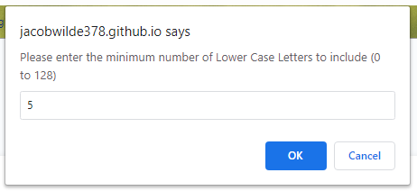
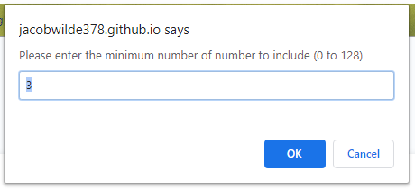
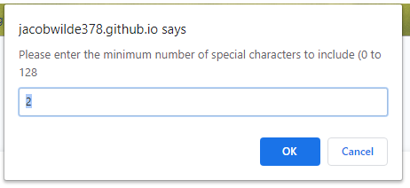
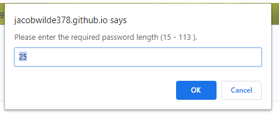
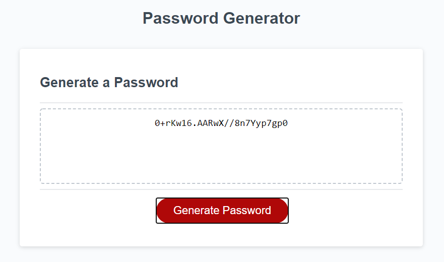

# PasswordProgram
## Program Description
This program will generate a random program for a user. The user is able to specify how the minimum characters to be included for Upper Case, Lower Case, Numbers and Special Characters.  The user will also specify the overall password length.
## Installation
This is a standard website.  You can find a live link to it here:  https://jacobwilde378.github.io/PasswordProgram/
## Screen Shots

